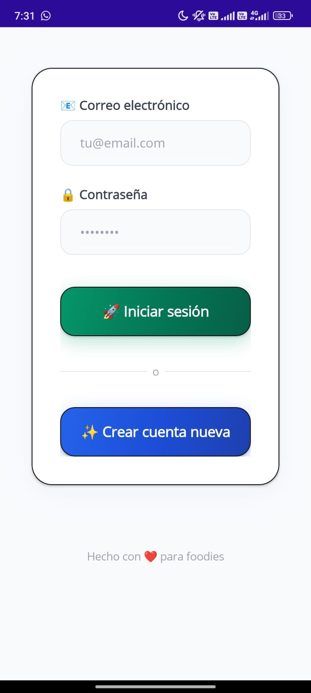
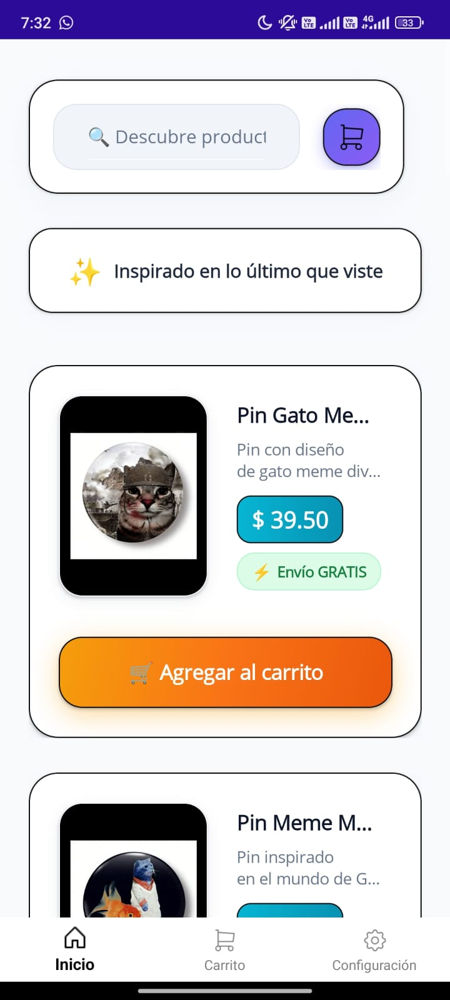
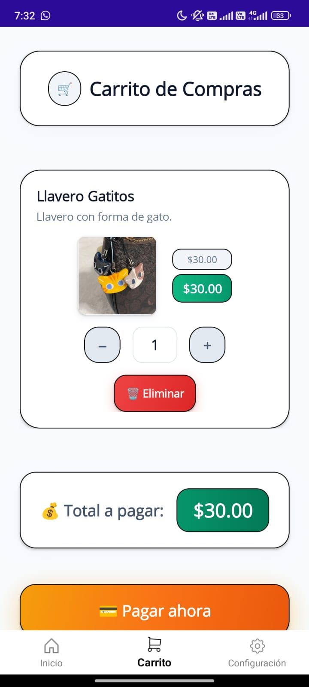

# 🛍️ MAUI Shop App con Supabase

Aplicación móvil desarrollada con .NET MAUI y Supabase como backend para autenticación, almacenamiento y gestión de carritos de compras.

## 🚀 Características

- Registro e inicio de sesión de usuarios
- Validación de correo electrónico
- Creación automática de carritos por usuario
- Gestión de productos: búsqueda, filtrado y detalles
- Carrito de compras dinámico (agregar, eliminar, actualizar cantidades)
- Diseño responsivo y moderno con XAML
- Integración con Supabase (Auth y PostgREST)

## 🧱 Tecnologías usadas

- [.NET MAUI](https://learn.microsoft.com/en-us/dotnet/maui/)
- [Supabase](https://supabase.com/)
  - Autenticación (`Auth`)
  - Base de datos (`PostgreSQL`)
  - API (`PostgREST`)
- C#
- XAML

## 📦 Estructura del proyecto

```
├── Models/              → Modelos de datos (Producto, Carrito, Usuario)
├── Views/               → Vistas de MAUI (Login, Home, Carrito)
├── Clases/              → Lógica de negocio y conexión Supabase (Consultas.cs)
├── DTO/                 → Clases auxiliares para mostrar datos combinados
├── Resources/           → Imágenes, estilos y temas
├── App.xaml / MainPage.xaml → App shell y navegación
```

## 🔐 Autenticación

- **Registro**: Se crea cuenta en Supabase y se solicita verificación por correo.
- **Inicio de sesión**: Verifica si el correo está confirmado antes de permitir el acceso.
- **Persistencia**: Se guarda el ID de usuario y carrito en preferencias locales con `Preferences`.



## 🛒 Carrito de compras

Cada usuario tiene un carrito único:
- Al iniciar sesión, se busca o crea un carrito relacionado al `user_id`.
- Se pueden agregar o eliminar productos dinámicamente.
- Los cambios se reflejan en la vista de `CarritoView`.

## 🖼️ Capturas de pantalla

*(Agrega aquí imágenes si tienes: login, home, productos, carrito)*

## 🛠️ Cómo ejecutar

1. Clona el repositorio:
```bash
git clone https://github.com/Tapia-GJ
```

2. Abre el proyecto en Visual Studio 2022+ con .NET MAUI instalado.

3. Configura tu archivo `Consultas.cs` con tu `SUPABASE_URL` y `API_KEY`.

4. Ejecuta en emulador Android o dispositivo físico.

## ✅ Próximas mejoras

- Recuperación de contraseña
- Notificaciones push
- Integración con pasarelas de pago (ej. Stripe o MercadoPago)
- Historial de compras

## 📄 Licencia

Este proyecto está bajo la licencia MIT. Libre de usar y modificar con fines educativos o comerciales.

---

Made with ❤️ by [Tapia](https://portafoliotapia.netlify.app/)
